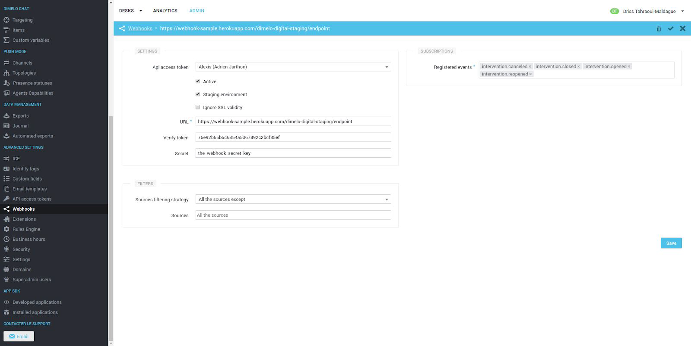
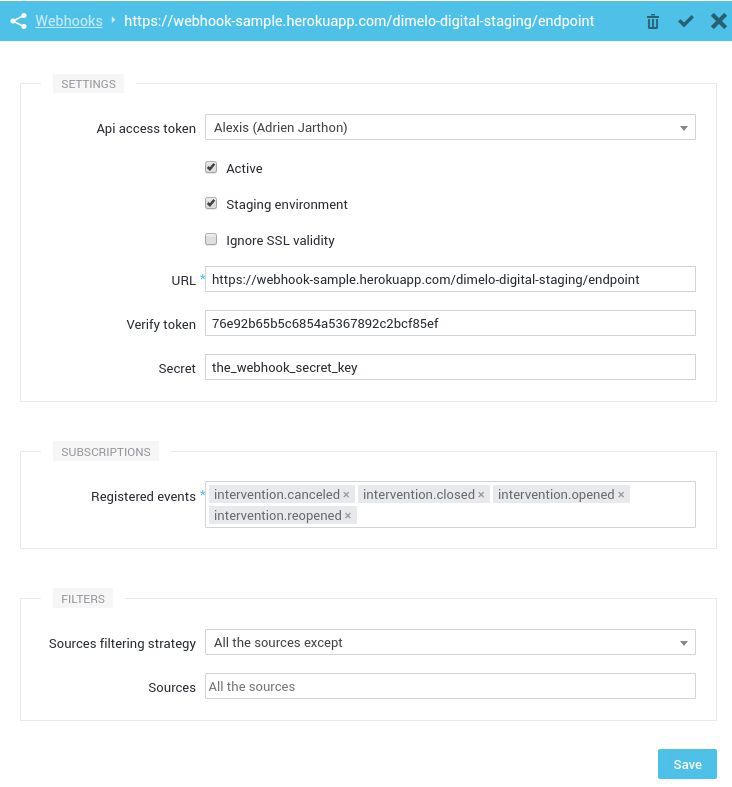
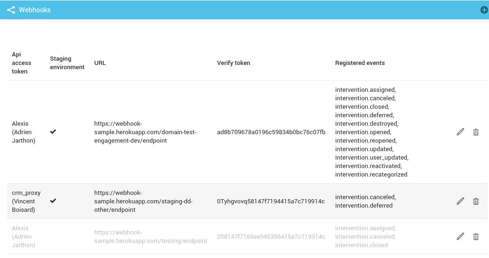
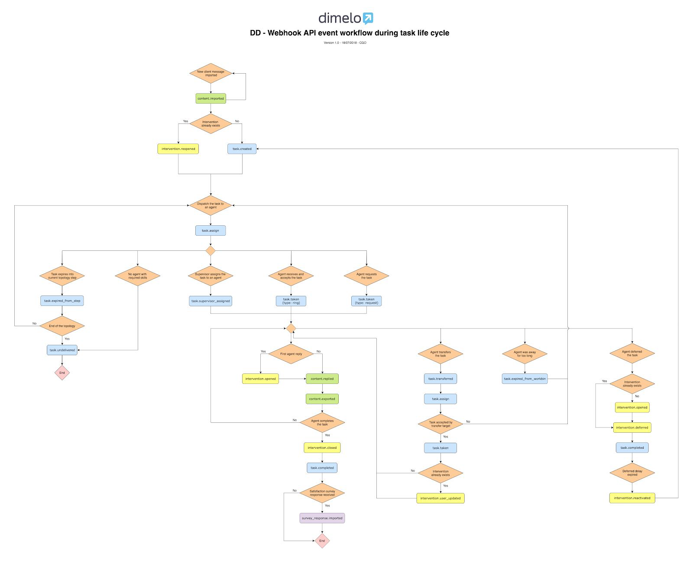

> Note: These documents are for RingCentral Engage Digital, formerly known as Dimelo. The product names in the documentation have not been updated yet.

# Introduction

Dimelo's Digital Platform provides a Webhook API to be notified when events occur. This API is almost realtime and provides an alternative to polling the REST API. The purpose is to be able to trigger event-based behavior as soon as an event occurs (intervention assigned, deferred, canceled...). This way you will be able to build gamification mechanism, live dashboard, synchronizing contents ...

The overall mechanism is based on ​[Pubsubhubbub protocol 0.3​](https://pubsubhubbub.github.io/PubSubHubbub/pubsubhubbub-core-0.3.html), and rely on HTTP request containing event payload being sent to a consumer Endpoint URL.

This document describes what can be done, under which conditions and the expected input and output formats and communication mechanism.

Development guidelines

We strongly advise developers consuming this API to respect the following guidelines:
* API input/output is standard [JSON​](https://www.ietf.org/rfc/rfc4627.txt) object encoded using UTF-8
* Always access a field using its name, not using its rank in the document
* Never rely on the ordering of elements in a JSON object unless specified
* Always use a JSON parser, as the object is subject to change (e.g. no regexp parsing)
* Expect new fields to appear without notice in event structure, and make sure that this can be handled by your code. We will preserve existing field though for backward compatibility as
long as we can.

# Webhook API Principles

## Notational conventions

The text of this specification provides the sole definition of conformance. Examples in this specification are non-normative.

The keywords "MUST", "MUST NOT", "REQUIRED", "SHALL", "SHALL NOT", "SHOULD", "SHOULD NOT", "RECOMMENDED", "MAY", and "OPTIONAL" in this document are to be interpreted as described in [​RFC2119]​.


## Technical introduction

This API is a “PUSH” / “REALTIME” / “OUTBOUND” API that will send JSON objects representing events occurring in Dimelo Digital to consumer endpoints through HTTP POST requests, one event at a time, almost realtime. Those consumers will be regular HTTP(s) endpoints powered by any technology and hosted anywhere. The API implements a retry policy to prevent events from being missed in case of transport issue or endpoint temporary unavailability.

# Register a Webhook API

In order to register an endpoint to the Webhook API, you MUST create a new endpoint in Dimelo Digital admin. Each endpoint MUST define the following items:



In details:



* An ​**API access token** is mandatory to create a webhook. You can only use API access token belonging to your user unless you have manage API access token permission you can use anyone.
* An endpoint, can be ​**active** or not. It allows you to add endpoint and to activate later or in case your endpoint encounters errors and is automatically disabled, you can re-activate it here.
* An endpoint is restricted to an environment, you can decide between production or staging. If it’s set to production, the endpoint will receive events only from the production platform and won’t receive anything from the staging platform. Respectively the same thing if it’s set to staging. By this way you could run events in the staging platform without damaged your production endpoint.
* If your endpoint has an invalid SSL certificate (eg: for testing purpose), you might want to activate the **Ignore SSL validity​** option that will prevent an SSL error on our end.
* A ​**URL​**. This URL MUST either be publicly available, or at least available from Dimelo’s IP range. We strongly advise to use HTTPS for this endpoint. The URL is unique by Api access token.
* A ​**verification token**.​ This can be any arbitrary string, but it is RECOMMENDED to be chosen randomly. Dimelo MAY generate the token if needed.
* A ​**secret** that will be served as a ​X-Dimelo-Secret header with every request (including the validation request). This field must only contain ​ASCII characters and shouldn’t be longer than 256 characters. The header won’t be present if there’s no secret configured. Also changing this field will trigger a validation request.
* A list of all ​**registrable events​**, only checked items will be used by your endpoint. At least one event must be selected to create your webHook. For more information, see ​Subscribing to events​.
* A ​**list of sources** for which events should or should not be broadcasted, depending on the "filtering strategy" used ("all sources except" or "no source except"). By default, events associated so any source are broadcasted.

Rather than creating a single endpoint listening to all the events, it is possible to create a number of specialized endpoint, listening to only certain events.

If more than one endpoint are registered to a specific event, event updates will be sent to every registered endpoint.

## Validation

The Webhook API doesn’t use authentication in the conventional sense, but enforces a validation of the endpoint before using.

To save a Webhook API configuration you can choose to:
* leave it disabled, it will skip the subscription validation
* enable it now, it will require your endpoint is ready to accept our subscription validation

The subscription validation is asynchronous, in detail it will perform a GET request on the endpoint URL with the following parameters:
* hub.mode: The string "subscribe" is passed in this parameter
* hub.challenge: a random string.
* hub.verify_token: the verify token entered when setting up the enabled URL.

When the endpoint receives this request, it:
* MUST have its content-type set to text/html in the header.
* SHOULD check the hub.mode is set to “subscribe”, it confirms we are registering an endpoint
URL.
* SHOULD check the hub.verify_token validity, to ensure the request comes from the
Webhook API.
* MUST respond with a status 200. The response body MUST contain only the hub.challenge.
When submitting your settings, if the required fields are not filled out, it will display an error message, or if it’s valid it will save the data and a subscription validation will be triggered. In case the subscription failed, ​your settings will be updated and this endpoint will be disabled​, you will have to go back on the API administration page to re-enable your endpoint.

When submitting your settings, if the required fields are not filled out, it will display an error message, or if it’s valid it will save the data and a subscription validation will be triggered. In case the subscription failed, ​**your settings will be updated and this endpoint will be disabled​**, you will have to go back on the API administration page to re-enable your endpoint.



## Subscribing to events

From the interface, go to the Webhook API administration page, select your endpoint, and select each event you wish to subscribe to.

## Receiving event

By default, endpoints will not receive any events, as they are subscribed to none. To know more about the subscription process, see S​ ubscribing to events.​
Once subscribed to events, endpoints will receive updates in the following fashion:
* Each event update is sent using an HTTP POST request on the endpoint URL.
* The endpoint URL MUST return with a status code 200 to acknowledge the reception of the
event.

### Guarantee on the event delivery

This Webhook API implementation tries to deliver the event notification request reasonably fast. We may buffer notification for efficiency reason.

We cannot guarantee the delivery of the events (see ​Unavailability of the endpoint)​ but we will retry the delivery during 24h until we know that the endpoint received them correctly.

We cannot guarantee the order in which the events arrived because of the internet HTTP protocol and the potential unavailability of the network or the target endpoint (see ​Unavailability of the endpoint)​ . We provide a timestamp in every event for the implementor to reorder them if needed.

We cannot guarantee that the events will be sent only once because of the nature of the HTTP protocol see ​Implementation considerations​. Nevertheless we provide a unique identifier per event so that events can be deduplicated at the endpoint level if unicity is a constraint.

### Unavailability of the endpoint

When an event notification request to an endpoint is not responsed by an HTTP 200 OK status (network issue, endpoint is down ...), the request will be retried. The request will be retried during ​12 hours​ almost 1​ 0 times​ with waiting time growing.
To give an order of magnitude of the waiting time before each retry (those data are for information only and are susceptible to change ):

Request | Time interval
--------|--------------
Try #1  | ~ 1 sec
Try #2  | ~ 15 sec
Try #4  | ~ 5 min
Try #5  | ~ 10 min

It means that when the first request fails the next retry is processed after 1 sec, then 15 seconds after the last retry... If it’s still failing this request will never be sent afterward.

If your endpoint your error rate is too high over a long period of time, we MAY have to disable the event notification requests. You SHOULD have to fix the problem before re-enabling the event notifications in the admin interface.

### Implementation considerations

While the rate of event updates is usually reasonable, it can greatly increase depending on external factors. Because of that, it is recommended that the endpoint URL does as little as possible, ideally just storing the event information in a queue for background processing.

Event updates will be sent at least once. In some cases, the same event MAY be sent several times, therefore the endpoint SHOULD be idempotent. In order to help achieve idempotency, each event update has a unique UUID, that will stay if sent more than one time.

## Diagram - Webhook events workflow

Below are some diagrams describing specific workflows for sending webhook events.

### Task life cycle



You can download webhook workflow diagram during task life cycle here:
[https://bit.ly/webhook-task-event-workflow-color](https://bit.ly/webhook-task-event-workflow-color)

## Event description Event type

Events type represent the various events you can registered to, see ​Registrable events​.

They are usually are composed of two parts, the event resource, and the event action.

The event resource represents the kind of object that generated the event, while the event action represents the cause of the event. For example, for the event type `intervention.assigned`, the event type is `intervention`, and the event action is `assigned`.

### Event payload

Before explaining in details the submitted payload, let’s have a look at the short example below where an endpoint is registered and is notified on intervention assignation.

The platform waits for an assignation on an intervention, when it detects an assignation, it makes a POST request to the previously registered endpoint with the following:

```JSON
{
  "​id":"bd13a9d9baa8c20cf93046cd",
  "​domain_id":1,
  "​events":[
    {
      "type":"intervention.assigned",
      "​id":"70d340997b8cd2c6f4dfee22",
      "​user_id":"4f4f3a08a90ffb27ee000583",
      "resource":{
        "​type":"intervention",
        "id":"5464b5c04d61639684110000",
        "metadata":{
          "custom_field_values":{
            "​sample_field":null
          },
          "​category_ids":[
            "​4f3951557aa58d1462017a8f",
            "50895dbea90ffb3c35001ace"
          ],
          "closed_at":null,
          "deferred_at":null,
          "identity_id":"​557f003c7765620fdc0002cc",
          "source_id":"56178fd27765625e06000a66",
          "thread_id":"​565739986b65795289000029",
          "​user_id":"​52fcf5157aa58dd768000006"
        }
      },
      "issued_at":"2014-02-10T18:35:35.251Z"
    }
  ]
}
```

Each request, would enforce the following JSON structure:

Property | Value | Description
---------|-------|------------
`id` | UUID | Unique request identifier. This can be used to detect duplicated request, for example in case of failure.
`domain_id` | Integer | Unique domain identifier.
`events` | Array of ​Event object | An array of generated events.

### Event object

Property | Value | Description
---------|-------|------------
type | String | The type of the event. Events MUST define this property. See ​Event definition​ below.
`id` | UUID | Unique event identifier. Events MUST define this property. This can be used to detect duplicate events in case of multiple send.
`resource` | Resource Object | It gives the resource of the event. Events MUST define this property.
`issued_at` | [​RFC3339]​ date-time | The date and time at which the event happened. Events MUST define this property. This can be used to order the events client-side.
`user_id` | UUID | Unique user identifier. ​Will only appear for event triggered by an agent.
`action` | String | /!\ task.completed only​, specifies the action leading to task completion, can be “deferred” or “closed”

### Resource object

Property | Value | Description
---------|-------|------------
`type` | String | Type of resource. Resources MUST define this property. This gives information about the type of resource that must be queried from the API
`id` | Integer | Unique resource identifier. Resources MUST define this property.
`metadata` | Metadata Object | A resource MAY define some metadatas. The metadatas are additionals informations supplied to help by avoiding making extra queries to get them.

#### Registrable events

The events are sorted by resource, the resource can be:

##### About interventions

Type | Description
-----|------------
`intervention.assigned` | When an agent is assigned to an intervention
`intervention.canceled` | When an agent cancels an intervention
`intervention.closed` | When an agent marks the intervention as closed
`intervention.deferred` | When an intervention is deferred for a period of time (the `intervention will be reactivated later)
`intervention.opened | When an intervention is started by engaging a customer
`intervention.reopened | When an intervention is reopened (by receiving a new message from the identity or manually by an agent, api ...)
`intervention.custom_fields_updated | When custom fields of an intervention are updated
`intervention.user_updated | When the agent of an intervention is changed (re-assigned)
`intervention.reactivated | When an intervention deferred time is finished
`intervention.recategorized | When categories on an intervention are changed

##### About tasks

Type | Description
-----|------------
`task.assigned` | When a new task is assigned to one or several agents
`task.completed` | When an agent marks a task as completed
`task.created` | When a task is created
`task.destroyed` | When contents are ignored or interventions are deferred or closed in folders view, related tasks are destroyed.
`task.expired_from_step` | When a task couldn't be delivered to any of the assigned agents for longer than the timeout defined for the topology step. It then continue to the next step.
`task.expired_from_workbin` | When a task was abandoned by an agent in his workbin automatically taken back by the DD to be routed to other agents.
`task.resume` | When an agent resumes handling of a task from his history or deferred tasks
`task.supervisor_assigned` | When a task is assigned to an agent by a supervisor and the option “Bypass queue and assign to agent” has been checked
`task.taken` | When an agent accepts a ringing task
`task.transferred` | When an agent or an administrator transfers a task to another agent
`task.undelivered` | When a task is moved into the undelivered queue

##### About push_agents

Type | Description
-----|------------
`push_agent.accept_task` | When an agent accepts a ringing task
`push_agent.availability_change` | When an agent's status changes
`push_agent.busyness_change` | When an agent’s busyness changes (according to the number of tasks in their workbin)
`push_agent.connected` | When an agent arrives on the push view
`push_agent.disconnected` | When an agent leaves the push view
`push_agent.reconnected` | When an agent reconnects after a network issue
`push_agent.request_task` | When an agent is busy but hasn’t reached the hard capability and requests an additional task

##### About contents

Type | Description
-----|------------
`content.approved` | When a content has been approved for publication. **This does not mean that the content has been published yet. Notifications about exports are done with content.exported.**
`content.discussion_initiated` | When a discussion has been started. **This does not mean that the content has been published yet. Notifications about exports are done with content.exported.**
`content.exported` | When a new content has been exported from Dimelo to the source. **This does not mean that the export succeeded. The synchronization_status field needs to be checked.**
`content.imported` | When a new content has been imported from the source to Dimelo.
`content.replied` | When someone replied to another content. **This does not mean that the content has been published yet. Notifications about exports are done with content.exported.**
`content.update_exported` | When a content has been update_exported (and the update has been propagated to the external source).

> ###### Warning note
> 
> To be notified of new content from customers you should watch for content.imported but be careful as you will receive more than just customer contents.
> 
> In particular the ​`content.imported` event means imported from a DD point of view, it notifies all interactions coming directly from the synchronized source. For example you publish a post on a managed facebook page without using the DD, a content.imported webhook will be triggered. For the Chat automatic welcome message (initial message) of the conversation will also be imported. So it’s not only customer message, this is a bit more complicated and some filtering may be required. To ignore those messages you will filter based on the status field to segregate actionable contents from customer Vs source itself.
> 
> Similarly, to be notified when a content has been exported from the DD to the source, you should watch for ​`content.exported` (new content) which will also notify automatic messages like survey or auto response and ​`content.update_exported` for update on existing content.
> 
> Finally, if you need more granular or earlier notification about contents creation, you can subscribe to ​`content.discussion_initiated` (new discussion), ​content.replied (reply on a message) and `content.approved​` (content has been approved).
> 
> It can be useful to understand the basic workflow of contents:
> 
> 1. A new content is created from Dimelo Digital: it can trigger `content.discussion_initiated` if a new thread has been initiated by an agent (outgoing content). Otherwise, regular replies to contents triggers content.replied.​ Those content may not be exported yet depending on approval settings.
> 2. If the content requires to be approved (​`approval_required` attribute is ​`true​`), it has to wait for an approbation. Once the approbation is received, content.approved​ is triggered.
> 3. The content can now be exported to the external source. Successful and Unsuccessful export operations trigger the ​`content.exported` event for new contents, and ​`content.update_exported` event for existing events that have been edited.


##### About identities

Type | Description
-----|------------
`identity.merged` | When an identity is merged to other identities.
`identity.unmerged` | When an identity is unmerged from other identities.

##### About surveys

Type | Description
-----|------------
`survey_response.imported` | When a response to a survey has been imported.

#### Metadata object

##### About interventions

Property | Value | Description
---------|-------|------------
`source_id` | String | Unique identifier for the source (facebook, email...)
`thread_id` | String | Unique identifier for the thread
`user_id` | String | Unique identifier for the agent of an intervention
`identity_id` | String | Unique identifier for the identity which created the content
`category_ids` | Array | Array of unique identifier by categories
`closed_at` | String | The date when the intervention was closed
`deferred_at` | String | The date when the intervention was deferred
`custom_field_values` | Custom field Object | It gives the custom fields linked to the object

##### About tasks

Property | Value | Description
---------|-------|------------
`channel_id` | String | Unique identifier for the channel
`priority` | Float | Priority of the task
`content_id` | String | Unique identifier for the content linked to the task
`intervention_id` | String | Unique identifier for the intervention linked to the task
`agent_ids` | Array | Array of unique identifier of agents assigned to the task
`action` | String | task.completed only, specifies the action leading to task completion, can be “deferred” or “closed”
`queue` | String | Task’s current workbin
`thread_id` | UUID | Unique identifier for the thread linked to the task
`type` | String | task.taken only, specifies if the agent requested a task or took a ringing one. Can be “ring” or “request”

##### About push_agents

Property | Value | Description
---------|-------|------------
`channels` | Array | Array containing data for each channel in push mode. Each channel has the following properties
`id` | String | Unique identifier for the channel
`name` | String | Name of the channel
`status` | String | Status of the push_agent on the channel
`busyness` | String | Busyness of the push_agent on the channel
`custom_status` | Hash | Id of the custom_status used by the agent

##### About contents

Property | Value | Description
---------|-------|------------
`id` | String | ID of the content
`approval_required` | Boolean | Whether the content require approval before being published
`author_id` | String | ID of the author of the content
`body` | String | Body of the content
`body_input_format` | String | Format of the body (html, text)
`created_from` | String | From where the content has been created (interface, API, ...)
`creator_id` | String | ID of the creator of the content
`date` | String | Date at which the content was created
`first_in_thread` | Boolean | Whether the content is the first of the associated thread
`foreign_categories` | Array of Strings | Foreign categories associated to the content
`foreign_id` | String | ID of the content on the external website
`has_attachment` | Boolean | Whether the content has one or multiple attachments
`intervention_id` | String | ID of the intervention associated to the content
`language` | String | Language of the content
`type` | String | Type of the content
`in_reply_to_author_id` | String | ID of the author of the content for which this content is a reply
`in_reply_to_id` | String | ID of the content for which this content is a reply
`private` | Boolean | Whether the content is a private message
`source_id` | String | ID of the source associated to the content
`status` | String | Status of the content
`synchronization_status` | String | For content.exported and content.update_exported event, the status of the synchronization (successful or unsuccessful).
`thread_id` | String | ID of the thread that owns the content
`thread_title` | String| Title of the thread that owns the content.

##### About identities

Property | Value | Description
---------|-------|------------
`new_identity_group_id` | String | ID of the new Identity Group attached to the identity after the merge/unmerge.
`old_identity_group_id` | String | ID of the Identity Group which was previously
attached to the identity before the merge/unmerge.

##### About surveys

Property | Value | Description
---------|-------|------------
`answers` | Hash | Survey question and responses
`submitted_at` | date-time | Date/time response was submitted (EST/EDT or GMT -5/GMT -4)
`response_id` | String | Survey external Response ID
`url` | Hash | URL variable value for Survey
`main_indicator` | Integer | Main question result
`main_indicator_scaled` | Float | Main question result scaled to 0..1
`intervention_id` | String | ID of the intervention related to this survey
`survey_id` | String | ID of the survey
`source_id` | String | ID of the source related to this survey
`user_id` | String | ID of the user related to this survey
`context_data` | Hash | Context_data is present only if the content has context_data associated. The context_data hash keys are the custom fields keys.

#### Custom field Object

Property | Value | Description
---------|-------|------------
`key` | String | To have more information you need to look in the DD custom field admin, it depends on your setup
`value` | String | To have more information you need to look in the DD custom field admin, it depends on your setup
